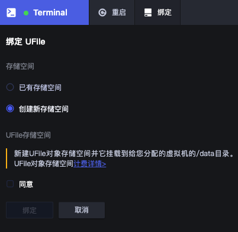
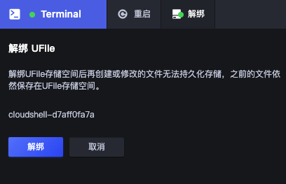

### 使用手册

1. 启动
    
   点击控制台顶部导航栏启动按钮或直接打开地址https://shell.ucloud.cn , 窗口（或页面）打开后，需要等待后台分配虚拟机，预计耗时10~20秒。
   
   
   
2. 关闭

   关闭页面和会话闲置超过30分钟都会导致会话关闭，用户所有会话关闭后不久，虚拟机会被回收。
   
3. 绑定

   若没有绑定持久化存储，虚拟机回收后，用户修改或添加的文件会丢失。绑定操作会挂载UFile存储桶到虚拟机/data目录，把文件放到此目录，文件会自动上传到UFile，
   Cloud Shell下次启动会把绑定的存储桶自动挂载到新的虚拟机。
   
   
    
4. 解绑
   
   解绑UFile存储桶会把Cloud Shell和存储桶解除绑定关系, Cloud Shell下次启动时不再自动挂载此存储桶。 
   